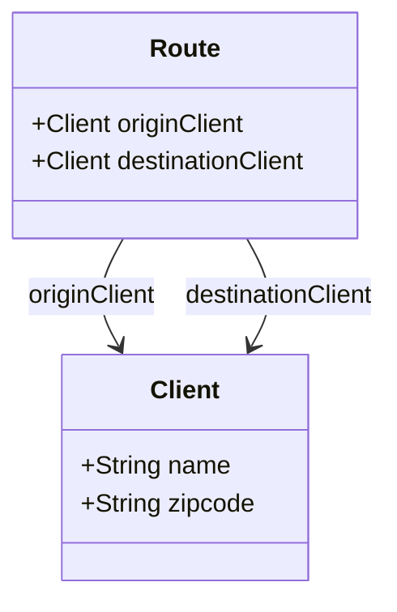

# KM COUNTER API
Java RESTful API criada para calculo de distância entre duas rotas. 

##Diagrama de Classes

```mermaid
classDiagram
    class Client {
        +String name
        +String zipcode
    }

    class Route {
        +Client originClient
        +Client destinationClient
    }

    Route --> Client : originClient
    Route --> Client : destinationClient
```
